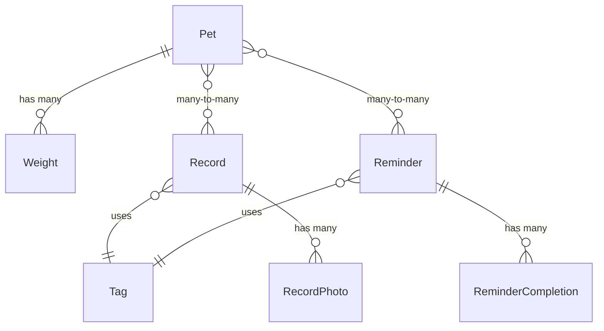

# SoulPets - 数据模型与核心逻辑设计 (v3.0)

本文档旨在为SoulPets iOS应用的开发提供一套清晰、健壮且可扩展的数据模型结构。本文档面向熟悉关系型数据库概念的开发者，通过类比和逻辑阐述，详细定义了基于SwiftData框架的实体关系和核心业务逻辑。

## 核心设计哲学

1.  **模板与实例分离 (Template vs. Instance)**：严格区分用于重复生成的“模板”（如`Reminder`）和由用户行为产生的“实例”（如`Record`, `ReminderCompletion`）。这保证了核心规则的纯粹性和系统的可扩展性。
2.  **职责单一原则 (Single Responsibility Principle)**：每个数据模型（表）只负责一件事情。`Record`负责详细记录历史，`ReminderCompletion`只负责标记完成状态，`Reminder`只负责定义计划规则。
3.  **数据驱动UI (Data-Driven UI)**：所有UI的显示状态都应由底层数据的查询结果唯一确定，避免在UI层维护复杂的状态。

## 数据模型概览 (ERD)

## 数据表结构详解

### 1. 宠物表 (Pet)

* **用途**：应用的核心，存储每一只宠物的完整档案信息。

| 字段描述 | 字段名 | 数据类型 | 备注 |
| :--- | :--- | :--- | :--- |
| 唯一ID | `id` | UUID | 主键，由系统自动生成。 |
| 宠物名 | `name` | String | |
| 宠物类型 | `petType` | Enum | `Cat`, `Dog`等。 |
| 品种/花色 | `breed` | String | |
| 头像 | `avatar` | Data | 存储图片二进制数据，可选。 |
| 性别 | `gender` | Enum | `Male`, `Female`, `Other`。 |
| 是否绝育 | `isNeutered` | Bool | |
| 生日 | `birthday` | Date | |
| 领养日 | `adoptionDay` | Date | 可选。 |
| 芯片ID | `microchipID` | String | 可选，为海外用户设计。 |
| 保险单号 | `insurancePolicyNo` | String | 可选，为海外用户设计。 |
| 体重单位偏好 | `weightUnitPreference`| Enum | `kg`, `lbs`。 |
| 创建时间 | `createdAt` | Date | |
| 最后更新时间 | `updatedAt` | Date | |

* **关联关系**：
    * **Weight (一对多)**: 一个`Pet`可以拥有多个`Weight`记录。删除`Pet`时会级联删除其所有体重记录。
    * **Record (多对多)**: 一个`Pet`可拥有多个`Record`，一个`Record`也可关联多个`Pet`。
    * **Reminder (多对多)**: 一个`Pet`可被多个`Reminder`关联，一个`Reminder`也可应用于多个`Pet`。

### 2. 标签表 (Tag)

* **用途**：作为数据字典，定义所有活动的类型。在App启动时应预置好数据。

| 字段描述 | 字段名 | 数据类型 | 备注 |
| :--- | :--- | :--- | :--- |
| 唯一ID | `id` | UUID | 主键。 |
| 唯一业务代码 | `code` | String | 例如 "daily.food"，稳定不变，用于程序逻辑。应建立唯一约束。|
| 显示名称 | `name` | String | 例如 "Dinner/Food"，用于UI显示。 |
| 图标名 | `iconName` | String | 用于UI显示。 |
| 所属分类 | `category` | Enum | `Daily Life`等，用于UI分组。 |
| 默认可用于提醒 | `defaultIsReminder` | Bool | 决定此标签在创建提醒时是否默认可选。 |
| 适用宠物类型 | `associatedPetTypes` | [Enum] | 宠物类型的数组，例如`[Cat, Dog]`。 |
| 创建时间 | `createdAt` | Date | |
| 最后更新时间 | `updatedAt` | Date | |

* **关联关系**：被`Record`和`Reminder`表所引用。

### 3. 记录表 (Record)

* **用途**：存储所有已经发生、用户希望留存的具体事件，构成宠物的历史时间线。

| 字段描述 | 字段名 | 数据类型 | 备注 |
| :--- | :--- | :--- | :--- |
| 唯一ID | `id` | UUID | 主键。 |
| 事件发生时间 | `timestamp` | Date | 精确到时间的事件发生点。 |
| 备注 | `notes` | String | 可选。 |
| 创建时间 | `createdAt` | Date | |
| 最后更新时间 | `updatedAt` | Date | |

* **关联关系**：
    * **Tag (多对一)**: 每个`Record`必须关联一个`Tag`。
    * **Pet (多对多)**: 指明此记录关联的宠物。
    * **RecordPhoto (一对多)**: 一个`Record`可拥有多张`RecordPhoto`。

### 4. 记录照片表 (RecordPhoto)

* **用途**：存储附加到`Record`上的照片数据。

| 字段描述 | 字段名 | 数据类型 | 备注 |
| :--- | :--- | :--- | :--- |
| 唯一ID | `id` | UUID | 主键。 |
| 图片数据 | `photoData` | Data | |
| 创建时间 | `createdAt` | Date | |
| 最后更新时间 | `updatedAt` | Date | |

* **关联关系**：
    * **Record (多对一)**: 每张照片都属于一条`Record`。

### 5. 体重表 (Weight)

* **用途**：专门用于追踪宠物的体重历史。

| 字段描述 | 字段名 | 数据类型 | 备注 |
| :--- | :--- | :--- | :--- |
| 唯一ID | `id` | UUID | 主键。 |
| 测量日期 | `date` | Date | |
| 体重数值(公斤)| `weightInKg` | Double | **最佳实践**：所有数据统一用公斤存储。 |
| 创建时间 | `createdAt` | Date | |
| 最后更新时间 | `updatedAt` | Date | |

* **关联关系**：
    * **Pet (多对一)**: 每个`Weight`记录都属于一个`Pet`。

### 6. 提醒表 (Reminder)

* **用途**：存储计划任务的“模板规则”，用于在未来生成待办事项。

| 字段描述 | 字段名 | 数据类型 | 备注 |
| :--- | :--- | :--- | :--- |
| 唯一ID | `id` | UUID | 主键。 |
| 首次发生时间 | `startDate` | Date | 定义提醒的起始点。 |
| 备注 | `notes` | String | 可选。 |
| 重复间隔 | `repeatInterval`| Int | 可选，例如 `3`。 |
| 重复单位 | `repeatUnit` | Enum | 可选，例如 `Weekly` (周)。 |
| 创建时间 | `createdAt` | Date | |
| 最后更新时间 | `updatedAt` | Date | |

* **关联关系**：
    * **Tag (多对一)**: 每个`Reminder`必须关联一个`Tag`。
    * **Pet (多对多)**: 指明此提醒规则应用于哪些宠物。
    * **ReminderCompletion (一对多)**: 一个提醒规则可以拥有多条完成记录。

### 7. 提醒完成表 (ReminderCompletion)

* **用途**：作为轻量级的“签到表”，仅用于标记某个提醒任务在特定日期已被完成。

| 字段描述 | 字段名 | 数据类型 | 备注 |
| :--- | :--- | :--- | :--- |
| 唯一ID | `id` | UUID | 主键。 |
| 完成日期 | `completionDate` | Date | **核心字段**，只关心年月日。 |
| 创建时间 | `createdAt` | Date | |
| 最后更新时间 | `updatedAt` | Date | |

* **关联关系**：
    * **Reminder (多对一)**: 每条完成记录都指向其源头的`Reminder`模板。

## 核心业务逻辑详解

### 1. 提醒与完成逻辑 (The Reminder & Completion Logic)

这是本应用最核心的逻辑之一，它保证了用户体验的顺畅和数据的严谨性。

1.  **生成待办**：提醒页面启动时，程序会获取所有`Reminder`模板，并根据其`startDate`, `repeatInterval`, `repeatUnit`在内存中动态计算出“今天”需要执行的待办事项列表。

2.  **用户完成任务**：当用户对今天的一条待办事项（如“给咪咪梳毛”）点击“完成”时，系统会执行以下原子操作：
    * **步骤A (立即执行)**：立刻在`ReminderCompletion`表中创建一条新记录。该记录的`completionDate`为今天，并关联到“给咪咪梳毛”的`Reminder`模板。
    * **步骤B (用户可选)**：随后，系统弹出对话框询问：“是否要为本次梳毛添加详细记录？”。用户的选择不会影响步骤A的结果。

3.  **判断完成状态**：当UI需要判断今天“给咪咪梳毛”这个任务的状态时（例如决定是否要继续在待办列表里显示它），它的查询逻辑是：
    > “在`ReminderCompletion`表中，是否存在一条记录，它关联着‘给咪咪梳毛’这个`Reminder`模板，并且其`completionDate`字段的日期是今天？”

4.  **逻辑闭环**：通过这个流程，即使用户拒绝创建详细的`Record`，系统也已经通过`ReminderCompletion`表“知道”了任务已被完成，从而可以正确地更新UI，避免了提醒“死灰复燃”的问题。

### 2. 多对多关系实现

在SwiftData中，开发者无需手动创建中间表（Join Table）。例如，对于`Pet`和`Record`的多对多关系，你只需：
* 在`Pet`模型中声明一个数组属性：`var records: [Record]?`
* 在`Record`模型中声明一个数组属性：`var pets: [Pet]?`
* 并使用`@Relationship(inverse: ...)`宏将它们互相关联。

SwiftData框架会自动处理底层的数据库实现，极大简化了开发工作。

### 3. 通用标签的计算逻辑

`Tag`表中没有“通用”这个类型。一个标签是否为“通用标签”，是在运行时动态计算出来的。
* **场景**：当用户同时选中了一只猫和一只狗，准备添加一条记录时。
* **逻辑**：程序会分别获取“适用于猫的标签列表”和“适用于狗的标签列表”，然后取这两个列表的**交集**。这个交集中的标签，就是当前上下文中的“通用标签”。这种实时计算的方式，为未来扩展更多宠物类型提供了极佳的灵活性。